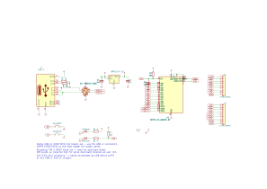

# c3-pico — minimalist ESP32-C3 dev board

> **Status: work in progress.** Schematic is complete and ERC-clean (0 errors,
> 0 warnings — [hardware/erc.rpt](hardware/erc.rpt)), and the header pinout is
> frozen (matches the module's physical pin order for a 1:1 fan-out). Board
> placement is done — antenna keep-out at the top edge, USB-C on the bottom edge,
> 1.0" header rows to straddle a breadboard. Routing is in progress: the USB-C
> differential-pair escape is being finished interactively. Gerbers land here once
> DRC is clean. Fully finished, fabrication-ready sibling project:
> [sht45-qt](https://github.com/FrancoSpitale/sht45-qt).

A no-frills ESP32-C3 development board in **KiCad 9**: USB-C with native USB,
3.3 V LDO, BOOT/RESET buttons and every usable GPIO on two breadboard-friendly
0.1" rows. Designed to be the board you actually reach for — nothing on it that
a blinky-to-production bring-up doesn't need.

## Design decisions

**Module, not chip-down.** ESP32-C3-WROOM-02 (PCB antenna, pre-certified RF)
instead of a bare ESP32-C3 with discrete RF. On a hobby/prototyping board the
~US$1 premium buys you regulatory-certified radio and zero antenna-matching
risk on a 2-layer board — chip-down C3 designs want controlled impedance and a
tuned pi network that this class of board can't justify.

**Native USB only, UART on the header.** The C3's built-in USB-Serial-JTAG
(GPIO18/19) goes straight to the USB-C connector — no CP2102/CH340, which
removes a BOM line, a failure mode, and ~US$0.50. GPIO18/19 are therefore *not*
on the headers; UART0 (IO20/IO21) is, for classic serial workflows and as the
escape hatch if an application reconfigures the USB pins.

**USB-C done by the spec.** 5.1 k pulldowns on CC1/CC2 mark the board as a UFP
device, so it powers up from USB-C hosts *and* C-to-C cables/chargers (boards
that skip these only work on A-to-C cables). USBLC6-2SC6 ESD array on D+/D−.

**Strapping pins handled, not hidden.** IO9 (BOOT) has its button; IO8 gets a
10 k pull-up (required high for serial download mode) and doubles as the user
LED, Espressif-devkit style. Both are still broken out — the pull-up is weak
enough to ignore in normal use.

**EN with RC delay.** 10 k pull-up + 1 µF on EN gives a clean power-on ramp and
a proper RESET button without a supervisor chip.

## Pinout (planned)

| Left | Right |
|---|---|
| 3V3 | IO0 |
| EN | IO1 |
| IO4 | IO2 |
| IO5 | IO3 |
| IO6 | IO21 (TX) |
| IO7 | IO20 (RX) |
| IO8 (LED) | IO10 |
| IO9 (BOOT) | 5V |
| GND | GND |

Header order mirrors the module's physical pin order — layout fans out 1:1
without crossings.

## Roadmap

- [x] Schematic, ERC-clean
- [x] Header pinout frozen (1:1 with module pin order)
- [x] Component placement (antenna keep-out, USB-C bottom edge, 1.0" breadboard rows)
- [ ] Finish routing (USB-C differential escape) + DRC-clean
- [ ] JLCPCB gerbers/BOM/CPL
- [ ] First fab run + bring-up notes

## License

MIT — see [LICENSE](LICENSE). Hardware provided as-is, no warranty.

---
*Franco Spitale, 2026.*
