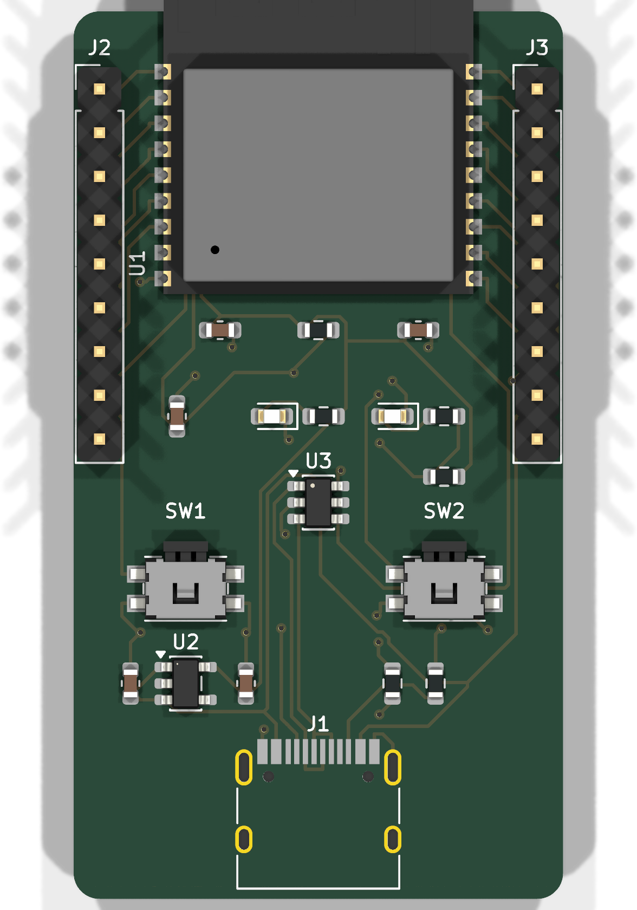
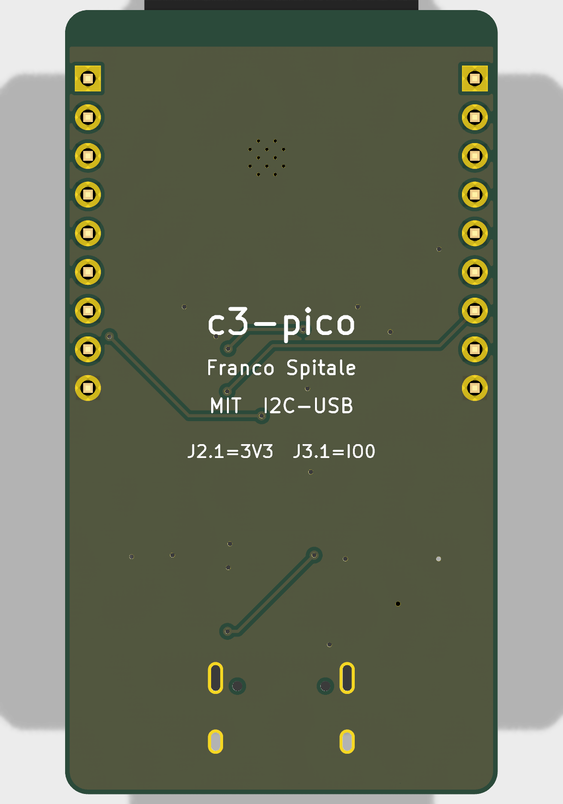

# c3-pico — minimalist ESP32-C3 dev board

A no-frills ESP32-C3 development board in **KiCad 9**: USB-C with native USB,
3.3 V LDO, BOOT/RESET buttons and every usable GPIO on two breadboard-friendly
0.1" rows. Designed to be the board you actually reach for — nothing on it that
a blinky-to-production bring-up doesn't need.

| Top | Bottom |
|---|---|
|  |  |

Schematic: [docs/schematic.svg](docs/schematic.svg) · Source: [hardware/](hardware/)

## Specs

| | |
|---|---|
| MCU | ESP32-C3-WROOM-02-N4 (RIS-V, Wi-Fi + BLE, 4 MB flash) |
| USB | USB-C, native USB-Serial-JTAG (no bridge IC) |
| Power | USB 5 V → AP2112K-3.3 LDO (600 mA) |
| I/O | 13 GPIO on 2 × 1×9 headers, 1.0" apart (breadboard) |
| Board | 28.4 × 51.5 mm, 2-layer, 1.6 mm FR-4 |
| Buttons | BOOT (IO9) + RESET (EN) |
| LEDs | power (green) + user (IO8, blue) |

## Design decisions

**Module, not chip-down.** ESP32-C3-WROOM-02 (PCB antenna, pre-certified RF)
instead of a bare ESP32-C3 with discrete RF. On a hobby/prototyping board the
~US$1 premium buys you regulatory-certified radio and zero antenna-matching
risk on a 2-layer board — chip-down C3 designs want controlled impedance and a
tuned pi network that this class of board can't justify.

**Native USB only, UART on the header.** The C3's built-in USB-Serial-JTAG
(GPIO18/19) goes straight to the USB-C connector — no CP2102/CH340, which
removes a BOM line, a failure mode, and ~US$0.50. GPIO18/19 are therefore *not*
on the headers; UART0 (IO20/IO21) is, for classic serial workflows and as the
escape hatch if an application reconfigures the USB pins.

**USB-C done by the spec.** 5.1 k pulldowns on CC1/CC2 mark the board as a UFP
device, so it powers up from USB-C hosts *and* C-to-C cables/chargers (boards
that skip these only work on A-to-C cables). USBLC6-2SC6 ESD array on D+/D−.

**Strapping pins handled, not hidden.** IO9 (BOOT) has its button; IO8 gets a
10 k pull-up (required high for serial download mode) and doubles as the user
LED, Espressif-devkit style. Both are still broken out — the pull-up is weak
enough to ignore in normal use.

**EN with RC delay.** 10 k pull-up + 1 µF on EN gives a clean power-on ramp and
a proper RESET button without a supervisor chip.

**Antenna overhang + bottom ground plane.** The module hangs off the top edge so
its PCB antenna clears the board copper (with a copper keep-out under the
antenna footprint as a belt-and-suspenders measure). The stackup is the classic
2-layer arrangement — signals and power on top, an unbroken ground plane on the
bottom — so every top trace has a clean return path directly beneath it.

## Pinout

| Left (J2) | Right (J3) |
|---|---|
| 3V3 | IO0 |
| EN | IO1 |
| IO4 | IO2 |
| IO5 | IO3 |
| IO6 | IO21 (TX) |
| IO7 | IO20 (RX) |
| IO8 (LED) | IO10 |
| IO9 (BOOT) | 5V |
| GND | GND |

Header order mirrors the module's physical pin order, so the layout fans out
1:1 with no crossings.

## Fabrication

`fabrication/c3-pico-gerbers-jlcpcb.zip` uploads directly to JLCPCB: 2 layers,
1.6 mm, ENIG recommended (fine-pitch module pads). `c3-pico-bom.csv` and
`c3-pico-pos.csv` are ready for the assembly service — add LCSC part numbers at
order time. The module and USB-C are the only fine-pitch parts; everything else
is 0603 or SOT-23.

## Verification

- ERC: 0 errors, 0 warnings ([hardware/erc.rpt](hardware/erc.rpt))
- DRC: 0 errors, 0 unconnected, 0 clearance/short/edge violations, schematic
  parity OK ([hardware/drc.rpt](hardware/drc.rpt)). One remaining info-level
  notice — U1's library footprint differs from stock because the module's
  antenna silkscreen was trimmed where it overhangs the board edge (deliberate).
- Routing: placed by hand for a clean fan-out, autorouted with
  [freerouting](https://github.com/freerouting/freerouting), then hand-verified.

## Repository layout

```
hardware/     KiCad 9 project (schematic, PCB, ERC/DRC reports)
fabrication/  Gerbers zip (JLCPCB), BOM, pick & place
docs/         Renders and schematic SVG
```

## License

MIT — see [LICENSE](LICENSE). Hardware provided as-is, no warranty; review before
fabricating. Not yet fabricated — if you build one, open an issue with results.

---
*Franco Spitale, 2026. Rev 1.0.*
